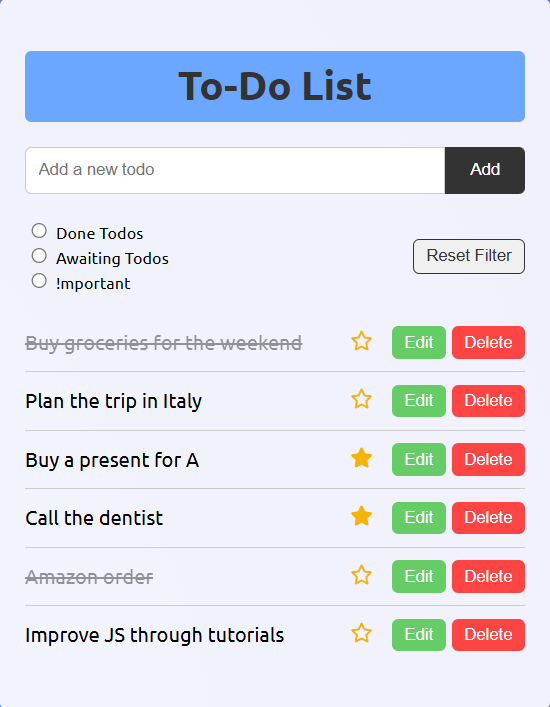

# To-Do List App
A simple and user-friendly To-Do List web application built with HTML, CSS and JavaScript. This app lets you manage tasks efficiently with features like marking importance, filtering and saving tasks locally. 



*Main view of the To-Do List app*

## Features
- **Add** new todos
- **Edit** and **Delete** existing todos
- **Mark todos as important** with a star icon
- **Mark the todo as done** with simply clicking on it 
- **Filter todos** by:
  - Done
  - Awaiting
  - Important
- **Persist todos** using 'localStorage'
- **Keep important tasks marked** even after refreshing or resetting the filter

## Demo 
[Live Demo](https://ibogoeska.github.io/todo-list/)

## Getting Started
1. Clone the repository
   ```bash
   git clone https://github.com/ibogoeska/todo-list.git
2. Navigate to the project folder and open index.html in your browser:
   ```bash
   cd todo-list
   open index.html

## Technologies Used 


## Author 
Created by @ibogoeska

### Future Enhancements 
- Add due dates and deadlines
- Drag and drop to reorder tasks
- Cloud/database sync
- Light/Dark theme toggle 
